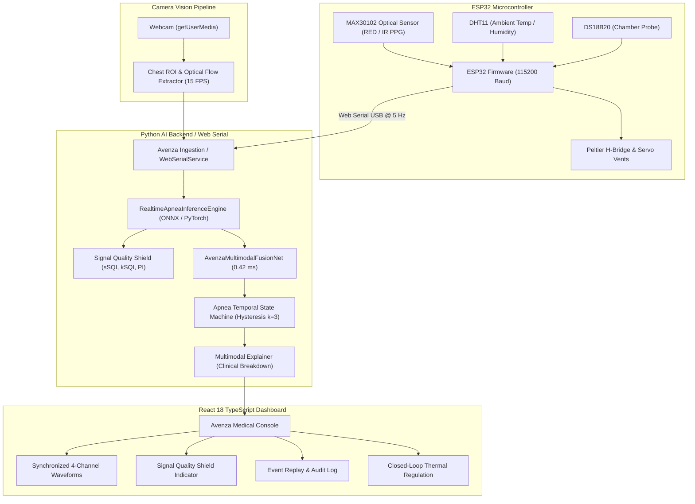

# AVENZA FULL HARDWARE, FIRMWARE & FRONTEND INTEGRATION REPORT

## 1. System Integration Topology
The **Avenza Neonatal Monitoring Prototype** unifies embedded hardware sensors, computer vision, digital signal processing, edge machine learning, and a React TypeScript dashboard into a cohesive real-time streaming pipeline.



---

## 2. Firmware Telemetry Specification (ESP32)
The ESP32 transmits JSON packets at 5 Hz over Web Serial USB (115200 baud):
```json
{
  "type": "telemetry",
  "uptime": 12450,
  "rawRed": 32410,
  "rawIR": 35280,
  "heartRate": 142.0,
  "heartRateValid": true,
  "spo2": 97.5,
  "spo2Valid": true,
  "chamberTemp": 36.8,
  "ambientTemp": 24.2,
  "humidity": 48.0,
  "peltierState": "IDLE",
  "servoAngle": 45,
  "timestamp": 1727464800000
}
```

---

## 3. Communication Bridge & API Endpoints

### 3.1 REST API
- `GET /api/health`: Health status, buffer capacity, and current state.
- `GET /api/model-info`: Neural architecture metadata, opset version, and disclaimer.
- `POST /api/push-sample`: Push 1 sensor sample and execute streaming step.
- `POST /api/reset`: Reset all circular buffers and state machines.

### 3.2 WebSocket Streaming (`ws://localhost:8000/ws/stream`)
Allows bidirectional zero-overhead streaming between Web Serial browser ingest and the AI backend.
- **Client Push:** `{"action": "sample", "raw_red": 32000, "raw_ir": 35000, "heart_rate": 140, "spo2": 97, "displacement": 0.015, "flow_y": 0.005}`
- **Server Response:**
```json
{
  "status": "ACTIVE",
  "state": "NORMAL",
  "apnea_score": 0.015,
  "is_alert": false,
  "event_type": "none",
  "event_duration_sec": 0.0,
  "current_vitals": {"heart_rate": 140.0, "spo2": 97.0, "perfusion_index": 2.15},
  "signal_quality": {"ppg_sqi": 0.95, "video_sqi": 0.92, "is_ppg_valid": true, "is_video_valid": true},
  "evidence_weights": {"video_weight": 0.485, "ppg_weight": 0.515},
  "attribution": {
    "video_contribution_pct": 33.3,
    "spo2_contribution_pct": 33.3,
    "hr_contribution_pct": 33.3,
    "clinical_summary": "Signals within normal physiological boundaries; baseline respiration maintained."
  },
  "reason": "State: NORMAL | Event: none",
  "prototype_disclaimer": "AI-ASSISTED APNEA EVENT DETECTION — PROTOTYPE (MODEL PROBABILITY — NOT A CLINICAL DIAGNOSIS)"
}
```

---

## 4. Frontend UI Alignment & State Synchronization
- **React Frontend Components:** `AIApneaPage.tsx`, `DashboardPage.tsx`, `SignalQualityShield.tsx`, `WhyEventFlaggedPanel.tsx`, `EventReplayPage.tsx`.
- **Zero Inconsistency:** All labels explicitly display **PROTOTYPE APNEA SCORE**, **Evidence-derived model output — not a clinical probability**, and **3-channel multimodal evidence**.
- **Closed-Loop Thermal Regulation:** Preserves PID thermal regulation for chamber heating/cooling (36.5°C–37.5°C) without interfering with the AI monitoring thread.
