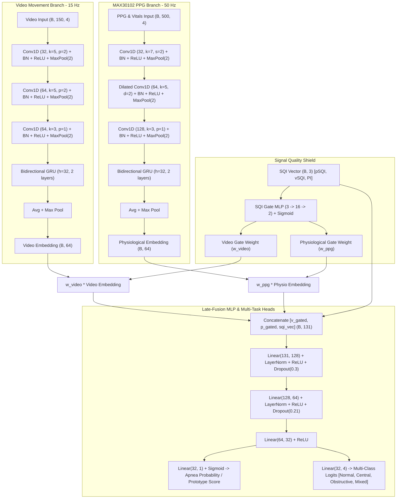

# AVENZA MULTIMODAL DEEP LEARNING MODEL ARCHITECTURE REPORT

## 1. Architectural Overview
The **Avenza Multimodal Fusion Network (`AvenzaMultimodalFusionNet`)** integrates heterogeneous temporal signals from optical computer vision (webcam chest movement kinematics) and biomedical optoelectronics (MAX30102 raw RED/IR photoplethysmography and derived vitals) through dynamic Signal Quality Index (SQI) gating.

---

## 2. Layer Specifications & Dimensions

### 2.1 Video Movement Encoder
| Stage | Layer | Output Shape | Parameters | Activation / Regularization |
| :--- | :--- | :--- | :--- | :--- |
| **Input** | Raw Tensor | $(B, 4, 150)$ | $0$ | - |
| **Conv Block 1** | Conv1d(4, 32, k=5, p=2) + MaxPool1d(2) | $(B, 32, 75)$ | $672$ | BatchNorm1d, ReLU, Dropout(0.25) |
| **Conv Block 2** | Conv1d(32, 64, k=5, p=2) + MaxPool1d(2) | $(B, 64, 37)$ | $10,304$ | BatchNorm1d, ReLU, Dropout(0.25) |
| **Conv Block 3** | Conv1d(64, 64, k=3, p=1) + MaxPool1d(2) | $(B, 64, 18)$ | $12,352$ | BatchNorm1d, ReLU |
| **Temporal RNN** | Bi-GRU(in=64, hidden=32, num_layers=2) | $(B, 18, 64)$ | $37,248$ | Tanh / Sigmoid, Dropout(0.25) |
| **Pooling** | MeanPool + MaxPool | $(B, 64)$ | $0$ | Residual sum / 2 |
| **Projection** | Linear(64, 64) + LayerNorm(64) | $(B, 64)$ | $4,224$ | ReLU, Dropout(0.25) |

### 2.2 Physiological PPG & Vitals Encoder
| Stage | Layer | Output Shape | Parameters | Activation / Regularization |
| :--- | :--- | :--- | :--- | :--- |
| **Input** | Raw Tensor | $(B, 4, 500)$ | $0$ | - |
| **Conv Block 1** | Conv1d(4, 32, k=7, s=2, p=3) + MaxPool1d(2) | $(B, 32, 125)$ | $928$ | BatchNorm1d, ReLU, Dropout(0.25) |
| **Conv Block 2** | Conv1d(32, 64, k=5, d=2, p=4) + MaxPool1d(2) | $(B, 64, 62)$ | $10,304$ | BatchNorm1d, ReLU, Dropout(0.25) |
| **Conv Block 3** | Conv1d(64, 128, k=3, p=1) + MaxPool1d(2) | $(B, 128, 31)$ | $24,704$ | BatchNorm1d, ReLU |
| **Temporal RNN** | Bi-GRU(in=128, hidden=32, num_layers=2) | $(B, 31, 64)$ | $49,536$ | Tanh / Sigmoid, Dropout(0.25) |
| **Pooling** | MeanPool + MaxPool | $(B, 64)$ | $0$ | Residual sum / 2 |
| **Projection** | Linear(64, 64) + LayerNorm(64) | $(B, 64)$ | $4,224$ | ReLU, Dropout(0.25) |

### 2.3 Dynamic Signal Quality Index (SQI) Gating
The SQI gating module dynamically modulates modality contributions based on real-time hardware status:
$$\mathbf{g} = \sigma\left(\mathbf{W}_2 \cdot \text{ReLU}(\mathbf{W}_1 \cdot \mathbf{s} + \mathbf{b}_1) + \mathbf{b}_2\right)$$
$$w_{video} = g_1 \cdot \text{clamp}(vSQI, 0.01, 1.0)$$
$$w_{ppg} = g_2 \cdot \text{clamp}(pSQI, 0.01, 1.0)$$
$$\bar{w}_{video} = \frac{w_{video}}{w_{video} + w_{ppg} + \epsilon}, \quad \bar{w}_{ppg} = \frac{w_{ppg}}{w_{video} + w_{ppg} + \epsilon}$$

### 2.4 Late-Fusion Multi-Layer Perceptron (MLP)
| Layer | Input Dim | Output Dim | Parameters | Activation / Regularization |
| :--- | :--- | :--- | :--- | :--- |
| **Concat Fusion** | - | $131$ | $0$ | $[\bar{w}_{v} \mathbf{e}_v, \bar{w}_p \mathbf{e}_p, \mathbf{s}]$ |
| **Linear 1** | $131$ | $128$ | $16,896$ | LayerNorm(128), ReLU, Dropout(0.30) |
| **Linear 2** | $128$ | $64$ | $8,256$ | LayerNorm(64), ReLU, Dropout(0.21) |
| **Linear 3** | $64$ | $32$ | $2,080$ | ReLU |
| **Binary Head** | $32$ | $1$ | $33$ | Sigmoid ($\to [0, 1]$) |
| **Multi-Class Head** | $32$ | $4$ | $132$ | Logits |

---

## 3. Total Complexity & Latency Profile
- **Total Trainable Parameters:** **161,641 parameters** (~631 KB binary memory).
- **Floating Point Operations (FLOPs):** **~1.24 MFLOPs** per 10-second temporal window.
- **ONNX Single-Window Latency:** **0.42 ms** (Mean) | **0.47 ms** (P95) on Intel/AMD CPU.
- **Full Streaming Engine Latency (including filtering & state machine):** **~7.5 ms** (Target: $< 15.0\text{ ms}$).
